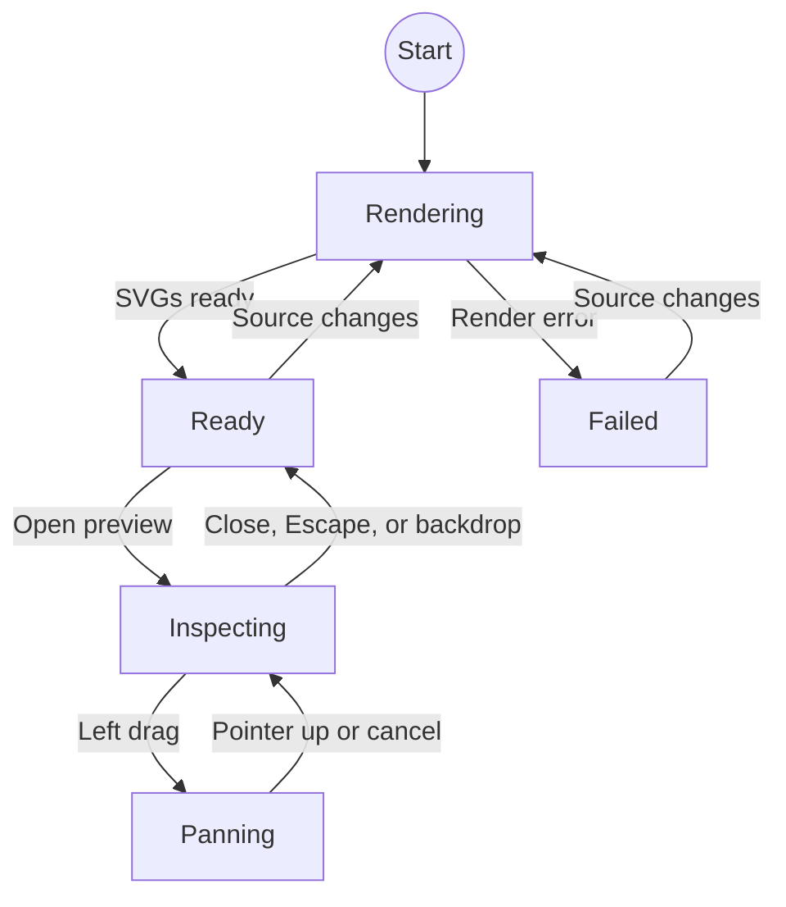

# MermaidZoom

`MermaidZoom` renders Mermaid source as a diagram preview. The preview opens a modal viewer for detailed diagrams.

## Usage

```svelte
<script lang="ts">
	import { MermaidZoom } from '$lib';

	const diagram = `flowchart LR
		Idea --> Build
		Build --> Present`;
</script>

<MermaidZoom code={diagram} label="Presentation workflow" />
```

Write the diagram with standard Mermaid syntax inside a JavaScript template string, then pass it through the `code` property.

## Properties

| Property | Type     | Required | Default                | Purpose                                  |
| -------- | -------- | -------- | ---------------------- | ---------------------------------------- |
| `code`   | `string` | Yes      |                        | Mermaid source to render.                |
| `label`  | `string` | No       | `Open Mermaid diagram` | Accessible label for the preview button. |
| `class`  | `string` | No       | Empty string           | Additional class applied to the preview. |

## Interactions

- Hover over the preview to see the zoom-in cursor.
- Click the preview to open the modal viewer.
- Use the mouse wheel to zoom from 50% to 400% around the pointer.
- Drag with the left mouse button to pan.
- Use the `−`, percentage, and `+` controls to zoom or reset the view.
- Press Escape, click the translucent background, or use the close button to exit the viewer. The SVG is
  shown on a Macchiato canvas, independent from the floating zoom controls.

Mermaid renders the diagram as SVG, so it remains sharp while zooming. The component stops pointer and keyboard events at the open dialog so Reveal.js does not change slides while the diagram is being inspected. Mermaid rendering uses strict security mode and is loaded only in the browser.

## State model

`MermaidZoom` keeps its render state and viewer state separate. Mermaid is initialized once and SVG rendering is
serialized; each ready state contains two separately identified SVGs with the same source and theme—one for the
preview and one for the viewer. This avoids global Mermaid configuration races and duplicate SVG IDs in the DOM.



When rendering reaches `ready`, the component waits for Svelte to paint the SVG, then calls Animotion's Reveal
instance `layout()` so a freshly loaded centered slide is measured again. The preview and viewer both use the same
Catppuccin Macchiato surface and Mermaid palette.

`Ready → Inspecting` is a preview click. `Inspecting → Panning → Inspecting` is a left-button drag, wheel and
toolbar input update the inspecting camera, and close, Escape, or a blank-stage click return to `Ready`.
