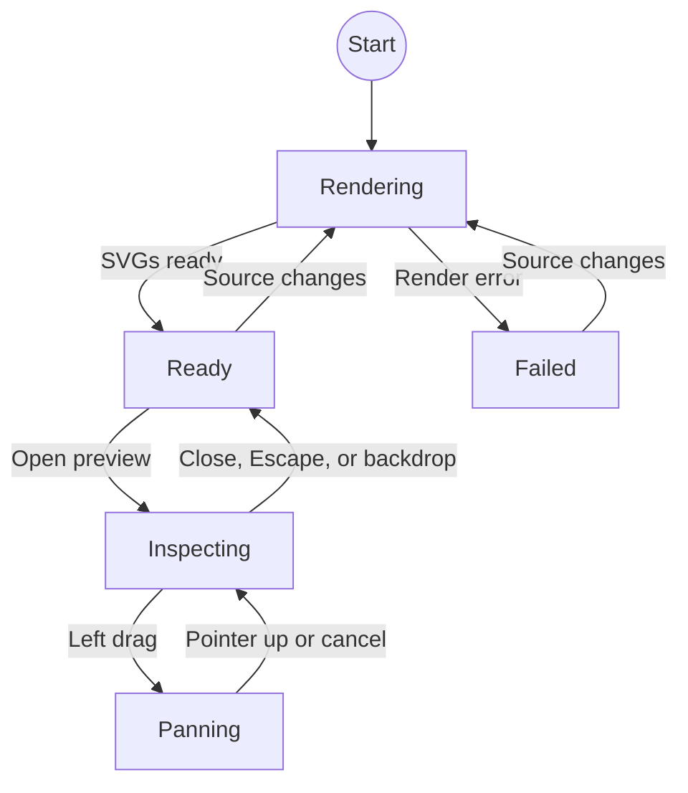

# MermaidZoom

`MermaidZoom` renders Mermaid source as a diagram preview. The preview opens a modal viewer for detailed diagrams.

## Usage

```svelte
<script lang="ts">
	import { MermaidZoom } from '$lib';

	const diagram = `flowchart LR
		Idea --> Build
		Build --> Present`;
</script>

<MermaidZoom code={diagram} label="Presentation workflow" />
```

Write the diagram with standard Mermaid syntax inside a JavaScript template string, then pass it through the `code` property.

## Properties

| Property | Type     | Required | Default                | Purpose                                  |
| -------- | -------- | -------- | ---------------------- | ---------------------------------------- |
| `code`   | `string` | Yes      |                        | Mermaid source to render.                |
| `label`  | `string` | No       | `Open Mermaid diagram` | Accessible label for the preview button. |
| `class`  | `string` | No       | Empty string           | Additional class applied to the preview. |

## Interactions

- Hover over the preview to see the zoom-in cursor.
- Click the preview to open the modal viewer. The viewer opens fitted to the window, up to 200%.
- If the source does not parse, the preview says so and clicking it opens the full Mermaid message in a
  monospace window with a copy button, instead of the viewer.
- Use the mouse wheel to zoom from 50% to 400% around the pointer.
- Drag with the left mouse button to pan.
- Use the `−`, percentage, and `+` controls to zoom or reset the view. `−` and `+` are disabled at the 50% and 400%
  limits.
- With the viewer focused, arrow keys pan, `+` and `-` zoom, and `0` resets.
- Press Escape, click the translucent background, or use the close button to exit the viewer. The SVG is
  shown on a Macchiato canvas, independent from the floating zoom controls.

Mermaid renders the diagram as SVG, so it remains sharp while zooming. The component stops pointer and keyboard events at the open dialog so Reveal.js does not change slides while the diagram is being inspected. Mermaid rendering uses strict security mode and is loaded only in the browser.

## State model

`MermaidZoom` models rendering as a discriminated union and the viewer as a camera plus an optional drag. Mermaid is
initialized once from the live Catppuccin custom properties, and SVG rendering is serialized. The preview SVG renders
with the component; the viewer SVG renders on first open under its own ID, so the two copies never share Mermaid IDs
in the DOM.



The diagram describes behaviour, not the type. Only `Rendering`, `Ready`, and `Failed` are a union in the code:
`Inspecting` is the dialog being open and `Panning` is a non-null drag. Making those variants too would have copied
the camera into states nothing could tell apart.

When rendering reaches `ready`, the component waits for Svelte to paint the SVG, then calls Animotion's Reveal
instance `layout()` so a freshly loaded centered slide is measured again. Preview and viewer share one surface rule:
a `base` plate with a `surface1` hairline, one step above its ground.
