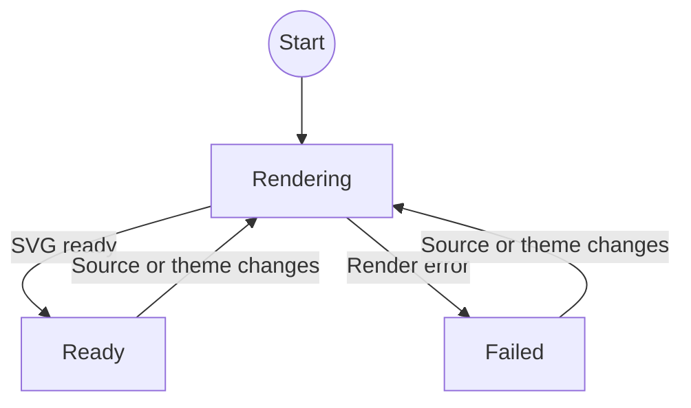

# Mermaid

`Mermaid` renders Mermaid source as a diagram on the slide. A diagram that renders is always zoomable,
through [Zoom](zoom.md). A diagram that does not render shows the Mermaid message in place instead.

## Usage

```svelte
<script lang="ts">
	import { Mermaid } from '$lib';

	const diagram = `flowchart LR
		Idea --> Build
		Build --> Present`;
</script>

<Mermaid code={diagram} label="Presentation workflow" />
```

Write the diagram with standard Mermaid syntax inside a JavaScript template string, then pass it through the
`code` property. The source is an ordinary `const`: nothing in the deck edits a diagram at runtime.

## Properties

| Property | Type     | Required | Default                | Purpose                                    |
| -------- | -------- | -------- | ---------------------- | ------------------------------------------ |
| `code`   | `string` | Yes      |                        | Mermaid source to render.                  |
| `label`  | `string` | No       | `Open Mermaid diagram` | Accessible label for the zoom trigger.     |
| `class`  | `string` | No       | Empty string           | Additional class applied to the outer box. |

## Rendering

Mermaid is loaded only in the browser, renders under strict security mode, and its renders are serialized.
The configuration is read from the live Catppuccin custom properties and applied on every render, so a theme
change reaches the next diagram.

Mermaid ships the SVG with `width="100%"`, which has no definite basis inside a shrink-to-fit parent and
collapses every diagram to the same arbitrary width. The component pins its wrapper to the `viewBox` width
instead, so the diagram lays out at its real size and the zoom camera is the only thing that scales it. The
preview cap is expressed through `--zoom-max-width` and `--zoom-max-height`, which the zoom plate clears.

One render feeds both copies. The preview and the enlarged copy come from the same SVG string, so the
enlarged one is rewritten into its own ID namespace before it is inserted. Mermaid prefixes every internal
ID with the diagram ID, references and the scoped `<style>` block included, so a single replace is enough.
Without it both copies would define the same marker IDs and every `url(#id)` in both would resolve to
whichever came first in the document. The rewrite happens inside the `zoomed` snippet, which only runs when
the viewer opens.

When rendering settles, the component waits for Svelte to paint, then calls Animotion's Reveal instance
`layout()` so a freshly sized slide is measured again.

## State model

Rendering is a discriminated union of three states. Only `ready` reaches `Zoom`.



`Failed` renders the Mermaid message on the slide in a monospace panel, on the same `base` plate with a
`surface1` hairline that every other diagram surface uses. Its copy control is an icon button that shows a
check for a moment after copying, then returns to the copy icon. The panel is deliberately not routed
through `Zoom`: the message is already full width, selectable, and copyable where it stands.
